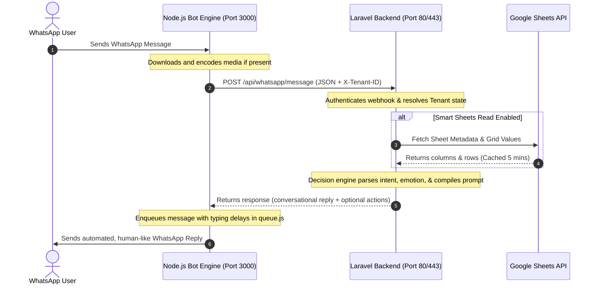

# iChatUp: System Architecture & AI Context Map
*Version 3.0 — Multi-Tenant AI WhatsApp Platform*

Welcome, future AI Assistant / Developer! This master document is a comprehensive architectural map of the **iChatUp** conversational platform. It details exactly how the codebase is structured, how the services communicate, and how the core features (Vision AI, Google Sheets syncing, and session preservation) are integrated.

---

## 🧭 1. Architectural Overview

iChatUp is built as a split-architecture, multi-tenant platform composed of two distinct components:

1. **Laravel 10 Backend (Ports 80/443):**
   * **Location:** `/app`
   * **Purpose:** Acts as the brain, administrative dashboard, database manager, and decision-maker. It maintains the SQLite database, exposes API webhooks, manages subscriptions, evaluates custom AI instructions, fetches live Google Sheets, and prepares AI-compiled system prompts.
2. **Node.js WhatsApp Engine (Port 3000):**
   * **Location:** `/bot`
   * **Purpose:** Handles direct socket connections to WhatsApp using the `@whiskeysockets/baileys` library. It listens for incoming messages, downloads user media, displays QR codes for pairing, manages automated message sending queues, and communicates with the Laravel backend via localized API bridges.

### 🔌 Service Interaction Diagram



---

## 📁 2. Key Directories & Core Files

```text
/whatsapp-ai
├── app/                              # LARAVEL BACKEND
│   ├── app/
│   │   ├── Http/Controllers/Api/     # WhatsApp Webhook & Status Controllers
│   │   ├── Http/Controllers/         # Admin Dashboard, Payments, & Integration Controllers
│   │   ├── Models/                   # Tenant, Lead, Message, WhatsappStatus models
│   │   └── Services/
│   │       ├── AIService.php         # Core Prompt Builder, decision engine, & OpenAI caller
│   │       ├── BotService.php        # Laravel API caller to the Node.js Express server
│   │       ├── GoogleSheetsService.php # Centralized Google Sheets integrations & dynamic writes
│   │       ├── MemoryService.php     # Message logger & conversational context compiler
│   │       └── SafetyService.php     # Rate limiting, human takeover, & working hours checks
│   ├── resources/views/              # Tailwind Dashboard Views
│   ├── database/migrations/          # SQLite migrations (e.g. adding sheet settings)
│   └── storage/app/                  # Persistent JSON credentials & QR scanners
│
├── bot/                              # NODE.JS WHATSAPP ENGINE
│   ├── src/
│   │   ├── index.js                  # Main runner (boots server & WhatsApp engine)
│   │   ├── server.js                 # Express API server for Laravel communication
│   │   ├── whatsapp.js               # Baileys socket setup, listeners, & senders
│   │   ├── queue.js                  # Humanized typing worker and retry queue
│   │   └── utils.js                  # Logger & parsing helper utilities
│   └── auth_session_<tenantId>/      # Cryptographic WhatsApp session dirs (auto-generated)
│
├── deploy.sh                         # Continuous integration & production script
└── future_action_and_backup_plan.md  # Detailed backup & image action plan
```

---

## ⚡ 3. The Message Lifecycle (API Bridge)

When a WhatsApp message is sent to an active tenant's number, it flows through the following pipeline:

### 1. Reception & Download (Node.js Bot)
* **File:** `bot/src/whatsapp.js`
* The Baileys socket triggers the `'messages.upsert'` listener.
* It extracts the sender's JID, converts it to a phone number (`jidToPhone`), and cleanses the text.
* **Smart Vision (Phase 2):** If an image is sent, the bot downloads the buffer, encodes it to **Base64** (`image_payload`), and sets the text placeholder as `[IMAGE_RECEIPT]`.
* **API POST:** The bot calls `POST /api/whatsapp/message` to the Laravel server, attaching the custom `X-Bot-Secret` and `X-Tenant-ID` headers to isolate customer data.

### 2. Processing & Safety Filters (Laravel Backend)
* **File:** `app/app/Http/Controllers/Api/WhatsAppWebhookController.php`
* **Tenant Isolation:** Resolves the `X-Tenant-ID` header and dynamically injects `tenant_id` into the container config (`app()->instance('tenant_id', $tenantId)`).
* **Duplicates & Logs:** Runs a cryptographic check to reject duplicated Baileys IDs and records the message in `messages` and `activity_logs`.
* **Receipt Analyzer:** If a Base64 image payload is present, it passes it to `ReceiptAnalyzerService::processReceiptForLead` to check if it matches a transfer screenshot. If verified, it automatically triggers a "trust-but-verify" response, logs the amount and reference ID, updates the stage to `payment_pending_verification`, and exits.
* **Safety Pipeline:** Checks if the chat is under **Human Takeover** (`hasHumanTakeover`), checks if the bot is enabled globally (`isBotEnabled`), evaluates working hours (`isWithinWorkingHours`), blocks spammers (`isRateLimited`), and scans for admin-alert keywords.

### 3. Context Compilation & Decision Engine
* **File:** `app/app/Services/MemoryService.php` & `AIService.php`
* If all safety checks pass, `MemoryService::buildContext` extracts the active short-term memory (recent conversational logs) and long-term user memories.
* `AIService::runDecisionEngine` sends a high-speed JSON request to OpenAI's `gpt-4o-mini` to determine the user's intent, mood, sales lifecycle stage, and optimal sales strategy.

### 4. Dynamic Prompt Building & Sheet Live Read
* **File:** `app/app/Services/AIService.php`
* The prompt compiler builds the system prompt dynamically:
  1. Injects the tenant's base Aira/agent identity prompt.
  2. Resolves the niche strategy guidelines.
  3. Injects custom payment credentials (UPI ID, bank info).
  4. **Smart Sheets Integration:** If the sync mode is `smart_read_write`, Laravel fetches the sheet data (cached for 5 minutes) via `GoogleSheetsService::getSheetValues` and compiles it into a grid format. It also appends the **custom sheet instructions** written by the tenant.
  5. Injects the current behavioral pipeline state (strategy, intent, mood).
* The combined prompt is sent to `gpt-4o-mini`.

### 5. Executing Actions & Sending Reply
* If the AI generates a dynamic row action block (`WRITE_ACTION: {"type": "write_sheet_row", "data": {...}}`), the system intercepts it, strips it from the conversational reply, maps the columns case-insensitively, and calls `GoogleSheetsService::appendDynamicRow` to push the row to Google Sheets.
* The conversational text response is stored in `messages` and passed to `BotService::sendReply`.
* `BotService` hits `POST /send` on the Node.js server.
* **Queue & Typing Delays:** `bot/src/queue.js` receives the request, enqueues the message, calculates a humanized typing speed delay based on the message length plus a random buffer delay (3–15s), simulates "typing..." status, and finally calls `whatsapp.js::sendMessage` to deliver the message to the user.

---

## 🗄️ 4. SQLite Database Schema & Models

Data isolation and dynamic routing depend heavily on these key models in `app/app/Models`:

### 1. `Tenant.php`
Represents an isolated business client. Important fields:
* `google_sheet_id`: The ID of the connected Google Sheet.
* `google_sheet_email`: The email address with which the sheet was shared (or "Manual Integration").
* `google_sheet_sync_mode`: `'leads_only'` (pushes leads to sheet) or `'smart_read_write'` (real-time query & dynamic append).
* `google_sheet_instructions`: Custom prompts telling the AI how to interpret the sheet data.
* `upi_id`, `upi_number`, `bank_name`, `bank_account_number`, `bank_ifsc`, `qr_code_path`: Direct payment settings.

### 2. `Lead.php`
Represents a sales lead captured automatically from WhatsApp conversations.
* `phone`: Client's WhatsApp number (primary key).
* `capture_stage`: Current lifecycle stage (`'new'`, `'exploring'`, `'engaged'`, `'interested'`, `'ready_to_buy'`, `'payment_pending_verification'`).
* `lead_score`: AI-calculated score (0-100) indicating engagement/buying intent.
* `summary`: Contextual AI digest of user preferences, questions, and transaction histories.

### 3. `Message.php`
Conversational chat logs for all users. Maintains the active memory context.

### 4. `WhatsappStatus.php`
Real-time session status trackers (monitors ban risks, latency, connection state, and QR base64 data for dashboard loading).

---

## 📊 5. Smart Google Sheets Integration

The Google Sheets integration utilizes a robust, error-tolerant architecture:

### 1. Dynamic Tab Title Resolution
* **File:** `app/app/Services/GoogleSheetsService.php` (`getFirstSheetTitle`)
* The service **never** assumes the first tab is named `"Sheet1"`.
* It calls Google API's metadata resolution on the spreadsheet:
  ```php
  $spreadsheet = $sheetsService->spreadsheets->get($sheetId);
  $sheets = $spreadsheet->getSheets();
  $title = $sheets[0]->getProperties()->getTitle();
  ```
* This prevents bad range parser exceptions if the user renames their primary sheet tab (e.g. to `'Clinets'`).

### 2. Live Read Caching
* Real-time querying can result in rate-limit throttling. 
* To prevent this, the live sheet read is cached for **300 seconds (5 minutes)** per tenant inside `AIService.php` under `tenant_sheet_data_{tenant_id}`.
* When the tenant saves updated custom AI instructions on the dashboard, the cache is instantly cleared (`Cache::forget`) to fetch fresh values.

### 3. Case-Insensitive Mapping
* When writing back a row, the AI outputs a raw JSON array. The system retrieves the spreadsheet headers, matches the AI's keys case-insensitively, and places the data in the corresponding indices before appending.

---

## 🔒 6. Predefined Payments & GD Compressions

### 1. UPI Credentials Injection
If UPI ID/number or bank details are set, the AI compiles a strict `=== PREDEFINED BUSINESS PAYMENT METHODS ===` prompt section, prohibiting the AI from hallucinating payment details.

### 2. GD Image Optimization
* **File:** `app/app/Http/Controllers/IntegrationController.php` (`uploadQrCode`)
* When an admin uploads a scanner QR code, the system processes it using the native PHP **GD Library**.
* It calculates the dimensions, auto-scales down to a maximum width of **800px** if larger (preserving aspect ratio), and applies **75% quality JPEG compression** to minimize server space usage and reduce mobile loading latency.

---

## 🛡️ 7. Sessions Resiliency & Backup Engine

To ensure that your servers can be upgraded or deployed without interrupting the active logins of your WhatsApp users, the deployment architecture has been explicitly hardened:

### 1. Persistent WhatsApp Sessions (`deploy.sh`)
When the production server is redeployed, the script executes:
1. **Pre-backup:** Before wiping out the workspace using `sudo rm -rf whatsapp-ai`, it detects if `whatsapp-ai/bot` has any active directories named `auth_session_*`. If found, it copies them securely to `/var/www/whatsapp-sessions-bak/`.
2. **Setup:** Clones the codebase, configures Composer, runs migrations, and installs npm modules.
3. **Restoration:** Instantly copies the session folders back into `whatsapp-ai/bot/` before launching PM2 daemons.
4. **PM2 Integration:** Restarts and locks processes inside PM2 using standard daemons:
   * `whatsapp-engine`: The Node.js Express server.
   * `laravel-queue`: The php artisan queue worker.

---

## 💡 8. Guidelines for Future AI Assistants / Developers

If you are asked to implement new features (such as Vision AI image querying or media QR code sending), follow these rules to maintain platform integrity:

1. **Maintain Data Isolation:** Always resolve the tenant ID using `app('tenant_id')` in Laravel and through `tenantId` parameters in the Node.js server.
2. **Never Hardcode Domain URLs:** In the backend, always use dynamic resolution (e.g. `url($path)`) to adapt to domain changes.
3. **Preserve Caching and Fallbacks:** When querying third-party APIs (Google Sheets, OpenAI, Gemini), always use try/catch blocks with loggers and clear fallbacks to prevent standard conversational flow from crashing.
4. **Do Not Store Auth Sessions inside Git:** Ensure `auth_session_*` remains in the Git ignore lists to prevent credentials exposure.
